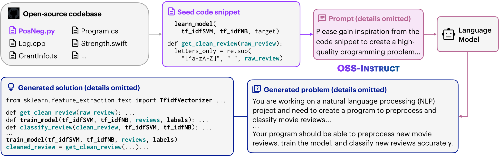
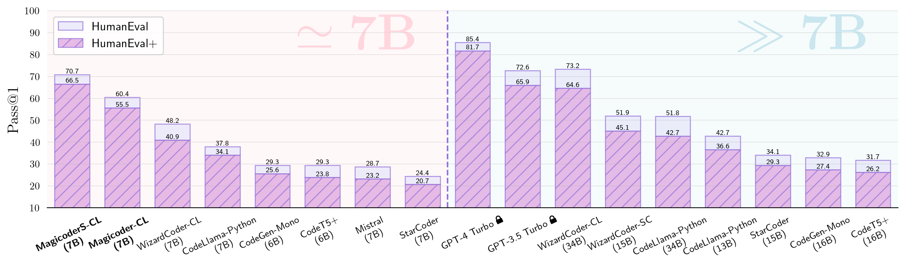

# 🎩 Magicoder: Source Code Is All You Need

<p align="left">
    <a href="https://openreview.net/forum?id=XUeoOBid3x"></a>
    <a href="https://arxiv.org/abs/2312.02120">
    <a href="https://opensource.org/license/mit/">
    <a href="https://huggingface.co/ise-uiuc/">
    <a href="https://twitter.com/magicoder_ai">
</p>

<p align="left">
    🎩&nbsp;<a href="#-models">Models</a>
    | 📚&nbsp;<a href="#-dataset">Dataset</a>
    | 🚀&nbsp;<a href="#-quick-start">Quick Start</a>
    | 👀&nbsp;<a href="#-demo">Demo</a>
    | 📝&nbsp;<a href="#-citation">Citation</a>
    | 🙏&nbsp;<a href="#-acknowledgements">Acknowledgements</a>
</p>

**We are thrilled that Magicoder and OSS-Instruct have inspired many amazing projects, including:**

- [Google CodeGemma](https://storage.googleapis.com/deepmind-media/gemma/codegemma_report.pdf)
- [OpenCodeInterpreter](https://opencodeinterpreter.github.io)
- [RTLCoder](https://arxiv.org/abs/2312.08617)
- [CodeUltraFeedback](https://arxiv.org/abs/2403.09032)
- [speechless-coder-ds-6.7b](https://huggingface.co/uukuguy/speechless-coder-ds-6.7b)

**Contact:** [Yuxiang Wei](https://yuxiang.cs.illinois.edu), [Zhe Wang](https://zhewang2001.github.io), [Yifeng Ding](https://yifeng-ding.com), [Jiawei Liu](https://www.jw-liu.xyz), [Lingming Zhang](https://lingming.cs.illinois.edu).

## About

* 🎩**Magicoder** is a model family empowered by 🪄**OSS-Instruct**, a novel approach to enlightening LLMs with open-source code snippets for generating *low-bias* and *high-quality* instruction data for code.
* 🪄**OSS-Instruct** mitigates the *inherent bias* of the LLM-synthesized instruction data by empowering them with *a wealth of open-source references* to produce more diverse, realistic, and controllable data.


> [!IMPORTANT]
> * [Magicoder-*S*-DS-6.7B](https://huggingface.co/ise-uiuc/Magicoder-S-DS-6.7B) outperforms `gpt-3.5-turbo-1106` and [Gemini Ultra](https://deepmind.google/technologies/gemini/) on HumanEval (**76.8** vs. [72.6 and 74.4])!
> * Find more detailed comparisons with other SOTA models on the **[🏆 EvalPlus Leaderboard 🏆](https://evalplus.github.io/leaderboard.html)**!




## 🎩 Models

| Model                 | Checkpoint                                                        | Size | HumanEval (+)       | MBPP (+)            | License                                                                           |
|-----------------------|-------------------------------------------------------------------|------|---------------------|---------------------|-----------------------------------------------------------------------------------|
| Magicoder-CL-7B       | 🤗 [HF Link](https://huggingface.co/ise-uiuc/Magicoder-CL-7B)     | 7B   | 60.4 (55.5)         | 64.2 (52.6)         | [Llama2](https://ai.meta.com/llama/license/)                                      |
| Magicoder-*S*-CL-7B   | 🤗 [HF Link](https://huggingface.co/ise-uiuc/Magicoder-S-CL-7B)   | 7B   | 70.7 (66.5)         | 68.4 (56.6)         | [Llama2](https://ai.meta.com/llama/license/)                                      |
| Magicoder-DS-6.7B     | 🤗 [HF Link](https://huggingface.co/ise-uiuc/Magicoder-DS-6.7B)   | 6.7B | 66.5 (60.4)         | 75.4 (61.9)         | [DeepSeek](https://github.com/deepseek-ai/DeepSeek-Coder/blob/main/LICENSE-MODEL) |
| Magicoder-*S*-DS-6.7B | 🤗 [HF Link](https://huggingface.co/ise-uiuc/Magicoder-S-DS-6.7B) | 6.7B | **76.8** (**70.7**) | **75.7** (**64.4**) | [DeepSeek](https://github.com/deepseek-ai/DeepSeek-Coder/blob/main/LICENSE-MODEL) |

## 👀 Demo

### Online Gradio Demo
Quickly try out our [Magicoder Playground](https://huggingface.co/spaces/ise-uiuc/Magicoder-S-DS-6.7B) powered by [gradio](https://www.gradio.app)! Huge thanks to [AK(@_akhaliq)](https://twitter.com/_akhaliq?lang=en) and the Hugging&nbsp;Face team for their support!

### Local Gradio Demo

We follow [WizardCoder](https://github.com/nlpxucan/WizardLM/blob/main/demo/wizardLM_demo.py) and provide the [script](demo/magicoder_demo.py) to build a local demo server. You can launch your local gradio demo as following:

```bash
cd demo
CUDA_VISIBLE_DEVICES=0 python magicoder_demo.py \
   --base_model "ise-uiuc/Magicoder-S-DS-6.7B" \
   --device "cuda:0" \
   --port 8080
```

## 📚 Dataset

* [Magicoder-OSS-Instruct-75K](https://huggingface.co/datasets/ise-uiuc/Magicoder_oss_instruct_75k): generated through **OSS-Instruct** using `gpt-3.5-turbo-1106` and used to train both Magicoder and Magicoder-S series.
* [Magicoder-Evol-Instruct-110K](https://huggingface.co/datasets/ise-uiuc/Magicoder_evol_instruct_110k): decontaminated and redistributed from [theblackcat102/evol-codealpaca-v1](https://huggingface.co/datasets/theblackcat102/evol-codealpaca-v1), used to further finetune Magicoder series and obtain Magicoder-S models.

## 🚀 Quick Start

```python
from transformers import pipeline
import torch

MAGICODER_PROMPT = """You are an exceptionally intelligent coding assistant that consistently delivers accurate and reliable responses to user instructions.

@@ Instruction
{instruction}

@@ Response
"""

instruction = "Implement a high-level API for a TODO list application. The API takes as input an operation request and updates the TODO list in place. If the request is invalid, raise an exception."

prompt = MAGICODER_PROMPT.format(instruction=instruction)
generator = pipeline(
    model="ise-uiuc/Magicoder-S-DS-6.7B",
    task="text-generation",
    torch_dtype=torch.bfloat16,
    device_map="auto",
)
result = generator(prompt, max_length=2048, num_return_sequences=1, temperature=0.0)
print(result[0]["generated_text"])
```

This code snippet will generate the following output:

``````
Here is a simple Python implementation of a TODO list API:

```python
class TodoList:
    def __init__(self):
        self.todo_list = []

    def add_task(self, task):
        if not isinstance(task, str):
            raise ValueError("Task must be a string")
        self.todo_list.append(task)

    def remove_task(self, task):
        if task not in self.todo_list:
            raise ValueError("Task not found in the list")
        self.todo_list.remove(task)

    def get_tasks(self):
        return self.todo_list

    def update_task(self, old_task, new_task):
        if old_task not in self.todo_list:
            raise ValueError("Old task not found in the list")
        if not isinstance(new_task, str):
            raise ValueError("New task must be a string")
        index = self.todo_list.index(old_task)
        self.todo_list[index] = new_task

    def clear_list(self):
        self.todo_list = []
```

This API allows you to add tasks, remove tasks, get all tasks, update tasks, and clear the list. It also raises exceptions for invalid operations.

You can use this API like this:

```python
todo = TodoList()
todo.add_task("Buy groceries")
todo.add_task("Finish project")
print(todo.get_tasks())  # Output: ['Buy groceries', 'Finish project']
todo.update_task("Buy groceries", "Buy fruits")
print(todo.get_tasks())  # Output: ['Buy fruits', 'Finish project']
todo.remove_task("Finish project")
print(todo.get_tasks())  # Output: ['Buy fruits']
todo.clear_list()
print(todo.get_tasks())  # Output: []
```
``````

## 📝 Citation

```bibtex
@article{wei2023magicoder,
  title={Magicoder: Source Code Is All You Need},
  author={Wei, Yuxiang and Wang, Zhe and Liu, Jiawei and Ding, Yifeng and Zhang, Lingming},
  journal={arXiv preprint arXiv:2312.02120},
  year={2023}
}
```

## 🙏 Acknowledgements

We thank [AK(@_akhaliq)](https://twitter.com/_akhaliq?lang=en) and the Hugging&nbsp;Face team for their support in the [Magicoder Playground](https://huggingface.co/spaces/ise-uiuc/Magicoder-S-DS-6.7B)!
We also thank the following amazing projects that truly inspired us:

- [WizardCoder](https://github.com/nlpxucan/WizardLM/tree/main/WizardCoder): Evol-Instruct
- [DeepSeek-Coder](https://github.com/deepseek-ai/DeepSeek-Coder): Base model for Magicoder-DS
- [CodeLlama](https://ai.meta.com/research/publications/code-llama-open-foundation-models-for-code/): Base model for Magicoder-CL
- [StarCoder](https://arxiv.org/abs/2305.06161): Data decontamination

## ⚠️ Important Note

- **Bias, Risks, and Limitations:** Magicoders may sometimes make errors, produce misleading contents, or struggle to manage tasks that are not related to coding.

- **Usage:** Magicoder models are trained on the synthetic data generated by OpenAI models. Please pay attention to OpenAI's [terms of use](https://openai.com/policies/terms-of-use) when using the models and the datasets. Magicoders will not compete with any OpenAI's commercial product.

## ⭐️ Star History

<a href="https://star-history.com/#ise-uiuc/magicoder&Timeline">
  <picture>
    <source media="(prefers-color-scheme: dark)" srcset="https://api.star-history.com/svg?repos=ise-uiuc/magicoder&type=Timeline&theme=dark" />
    <source media="(prefers-color-scheme: light)" srcset="https://api.star-history.com/svg?repos=ise-uiuc/magicoder&type=Timeline" />
    
  </picture>
</a>

